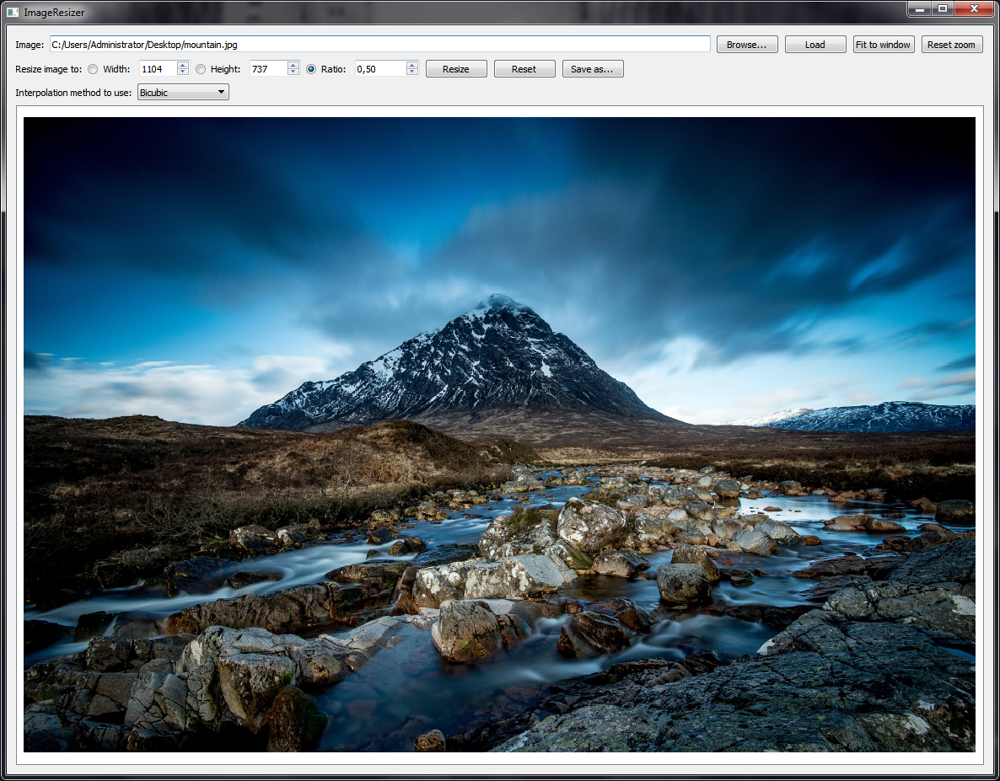
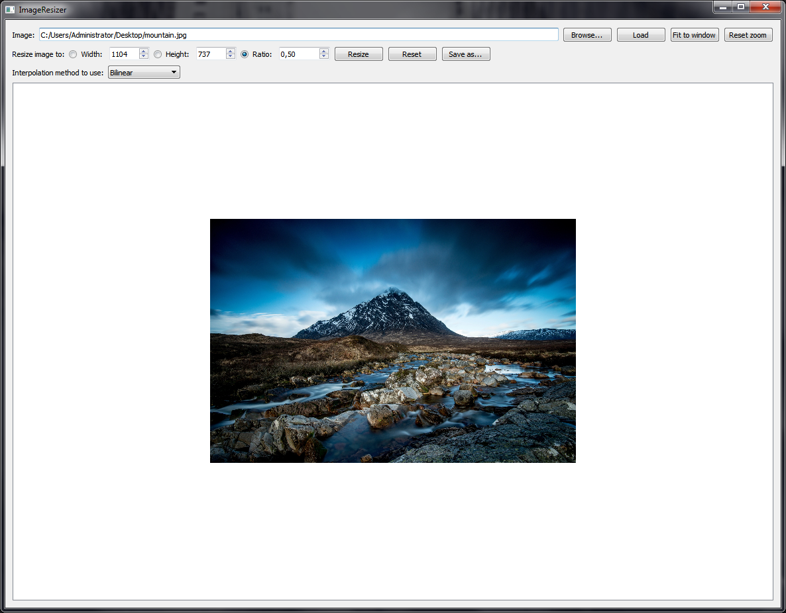

# ImageResizer
Tool capable of resizing images using the nearest neighbor, bilinear interpolation and bicubic interpolation algorithms. Written in Qt/C++.

## Download
Download link: [Win32 binary](https://github.com/Extender/ImageResizer/raw/master/bin/imageresizer-v1.0-bin-win32.zip)

## Screenshots

### Input

### Resized using bilinear interpolation

### Resized using bicubic interpolation
Note the higher quality of the output image.  

